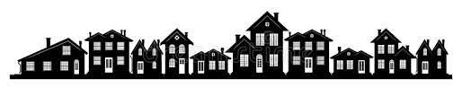

# Project 2 - Ames Housing Data and Kaggle Challenge

_Author: Afolabi Cardoso_

---
#### Contents

[Problem Statement](#Problem-Statement) | [Dataset](#Dataset) | [Brief Summary](#Brief-Summary) | [Methodology](#Methodology) | [Modeling](#Modeling) | [Evaluation](#Evaluation) | [Conclusion](#Conclusion) | [Recommendations](#Recommendations)

---
### Problem Statement
I am a Data Science Phd student at MIT and my Supervisor asked me to determine the best Linear Regression technique to use in determining the Sale Price of houses in his home town of Ames, Iowa.

---
### Dataset
Kaggle housing dataset Ames, Iowa

##### Data Dictionary

Click<a href="https://www.kaggle.com/c/dsir-0124-project-2-regression-challenge/data"> here </a> for the data dictionary

---
### Brief Summary 

This project seeks to determine the best Linear Regression technique to use in predict the sale price of houses in Iowa.  

I will be comparing these three techniques

- <b>Linear Regression or Ordinary Least Square or OLS</b>
- <b>Lasso Regression</b>
- <b>Ridge Regression</b>

---
### Methodology

#### Data Import
Using pandas library I imported the dataset from the kaggle website and created a  pandas dataframes for both train data and test data

No external data is required for this project

#### Data Cleaning 

- Dropping the columns with information not relevant to the housing
- Drop features have too many missing values
- Replace null values in the numerical feature with it's mean
- Replace null values in the categorical data with it's mode

#### EDA

This notebook uses exploratory data anysis techniques to visualize the relationsips between features and SalePrice.

- I start by generating a heat map to show correlation between variables and SalePrice
- I exploring the variables with large number of missing values and checking to see if dropping them will be beneficial
- I explore the numerical variables and select the features with strong correlation with the SalePrice
- Finally I explore the categorical variables and check for colinearity

#### Feature Selection

In order to be able to use the categorical variables in the model, I used a pandas method called get_dummies. This method converts each category in a feature into columns.

For the Lasso and Ridge models, I applied **Standard Scaler** to the features before fitting. The standard scaler helps transform all the features into a uniform scale 

I did this to both the train and test dataset

---
### Modeling
I generated four models

- Linear Regression with only numerical features
- Linear Regeression with both numerical and categorical features
- Lasso regression
- Ridge regression

---
### Evaluation

|Evaluation|OLS(numerical)|OLS(dummified)|Lasso|Ridge
|---|---|---|---|---| 
|**Train set $R^2$ score**|0.8001|0.8960|0.8896|0.8883
|**Test set $R^2$ score**|0.8520|0.8861|0.9045|0.9059
|**Cross evaluation $R^2$**|0.7396|0.7911|0.8004|0.8163
|**Root Mean Squared Error**|30138.22|26437.17|25212.69|25024.05

---
### Conclusions

The OLS(numerical) had a low $R^2$ score for cross evaluation;<b> 73.9% </b>which indicates a model with <b> high bias</b>. This is expected  because only the numeric features were utilized in training the model.

The $R^2$ score for the dummyfied model is<b> 79%. </b> This indicates an improvement from the previous model. The addiction of more features helped reduce the bias.

The Ridge model has an $R^2$ score of <b> 81% </b> which is very close to that of Lasso regression <b> 80%. </b>

For this housing dataset, both the ridge and lasso regression models performed better than the linear regression/OLS models. 

---
### Recommendations

I recommend to use either the Ridge or the Lasso model because they both gave a better overall result.

As more data is collected the model will be reevaluated to see if the results still holds true.
